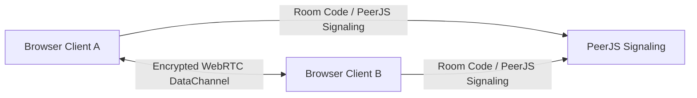
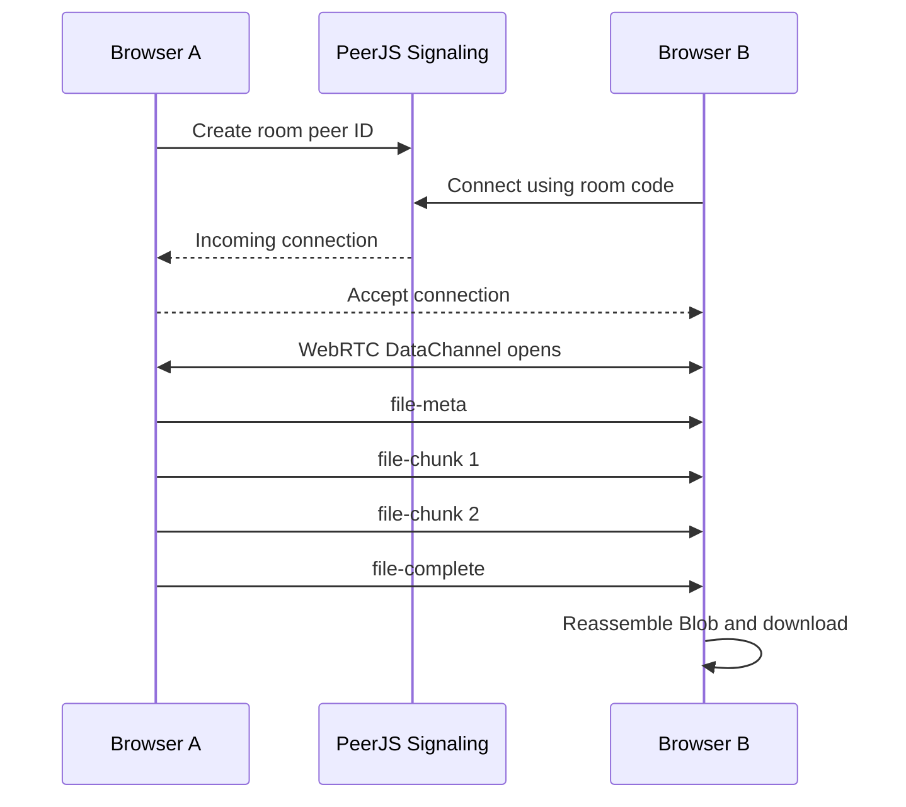

# ez-drop ⚡

**Zero-cost · Serverless · Peer-to-peer file transfer**

ez-drop is a lightweight browser-to-browser file and text sharing app built for static hosting. It runs on GitHub Pages, uses WebRTC for direct peer-to-peer transfer, and avoids backend storage entirely.

> Direct transfer. No login. No database. No upload server.

---

## Field Notes

| Item           | Details                                        |
| -------------- | ---------------------------------------------- |
| Project        | ez-drop                                        |
| Type           | Static P2P Web App                             |
| Deployment     | GitHub Pages                                   |
| Runtime        | Browser only                                   |
| Backend        | None                                           |
| Transfer Layer | WebRTC DataChannel                             |
| Signaling      | PeerJS                                         |
| License        | MIT                                            |
| Creator        | [@vyas-devgna](https://github.com/vyas-devgna) |

---

## What ez-drop Does

ez-drop lets two browsers connect using a short room code, direct link, or QR code. Once connected, both users can send files and text directly to each other.

The app is designed for simple local sharing between devices without creating accounts, uploading files to a server, or maintaining backend infrastructure.

---

## Core Features

* **5-digit room code pairing**
* **Direct share link support**
* **QR code based joining**
* **Peer-to-peer WebRTC transfer**
* **File drag-and-drop**
* **Multiple file transfer**
* **Clipboard/text transfer**
* **Session transfer history**
* **Installable PWA support**
* **Offline app shell through service worker**
* **Mobile-first responsive UI**
* **No backend or paid deployment required**

---

## Visual Identity

ez-drop uses an **Editorial Brutalist Sketchbook** design system.

The interface avoids generic SaaS styling and uses:

* Warm paper-like backgrounds
* Strong black borders
* Tactile buttons
* Hard offset shadows
* Editorial metadata labels
* Minimal sketchbook-style accents
* Clean, mobile-first layouts

The goal is to make the app feel simple, fast, trustworthy, and visually memorable without making the interface bloated.

---

## How It Works



PeerJS is used only to help the browsers discover and connect to each other. After the WebRTC DataChannel is open, file chunks and text messages move directly between browsers.

No file is intentionally stored on an application server.

---

## Transfer Flow



---

## Adaptive Transmission Protocol

Files are split into small binary chunks before transfer. The receiver reassembles the chunks into a Blob and triggers a download when the transfer is complete.

Default chunk size:

```text
64 KB
```

---

## Protocol Messages

ez-drop uses small structured messages over the WebRTC DataChannel.

### 1. File Metadata

```json
{
  "type": "file-meta",
  "from": "Paper Tiger",
  "payload": {
    "transferId": "tx-98asd2f3a",
    "name": "archive.zip",
    "size": 154857600,
    "type": "application/zip",
    "totalChunks": 2363
  }
}
```

### 2. File Chunk

```json
{
  "type": "file-chunk",
  "payload": {
    "transferId": "tx-98asd2f3a",
    "chunkIndex": 412,
    "data": "[ArrayBuffer Slice]"
  }
}
```

### 3. File Complete

```json
{
  "type": "file-complete",
  "payload": {
    "transferId": "tx-98asd2f3a"
  }
}
```

---

## Security & Privacy

ez-drop is designed around local-first, peer-to-peer transfer.

* **No login required**
* **No database**
* **No file upload server**
* **No account storage**
* **No cloud file hosting**
* **WebRTC DataChannels are encrypted in transit**
* **Files are transferred directly between connected browsers**
* **Received files may exist in browser memory until downloaded, cleared, or the page is closed**

Optional passphrase-based pairing can be used as an extra access check, but WebRTC encryption is still handled by the browser.

---

## Static Deployment

ez-drop is designed to run as a static GitHub Pages project.

Recommended structure:

```text
.
├── index.html
├── sw.js
├── manifest.webmanifest
└── assets/
    └── logo.png
```

---

## GitHub Pages Deployment

1. Push the project to GitHub.
2. Open the repository settings.
3. Go to **Pages**.
4. Select the branch and folder used for deployment.
5. Save the settings.
6. Open the generated GitHub Pages URL.

Example URL:

```text
https://yourname.github.io/ez-drop/
```

---

## PWA Support

ez-drop can be installed as a web app when the browser supports PWA installation.

Required files:

* `index.html`
* `manifest.webmanifest`
* `sw.js`

The service worker caches the app shell so the interface can load again even when offline.

> Peer-to-peer transfer still requires network availability and browser WebRTC support.

---

## Browser Support Notes

ez-drop depends on modern browser APIs:

* WebRTC
* DataChannel
* File API
* Clipboard API, where available
* Camera API for QR scanning, where available
* Service Worker for offline shell caching
* Web App Manifest for installation

Some restricted school, office, or mobile networks may block WebRTC traffic. In that case, switching networks or using a hotspot may help.

---

## Design Goals

ez-drop is built to be:

* Simple enough for non-technical users
* Fast enough for local sharing
* Free to deploy
* Easy to maintain
* Mobile-friendly
* Installable
* Private by default
* Useful without accounts or servers

---

## Limitations

Because ez-drop has no backend and no paid TURN server, some edge cases may fail depending on network conditions.

Known limitations:

* WebRTC may fail on strict NAT or blocked networks.
* Very large files may use significant browser memory.
* Auto-download behavior depends on browser permissions.
* iOS browser support may be more limited.
* The public PeerJS signaling service availability is external to this app.

The app should always show a clear fallback or recovery message instead of silently failing.

---

## Repository

[vyas-devgna / ez-drop](https://github.com/vyas-devgna/ez-drop)

---

## License

This project is released under the **MIT License**.

---

## Author

Built by [Devgna Vyas](https://github.com/vyas-devgna).
