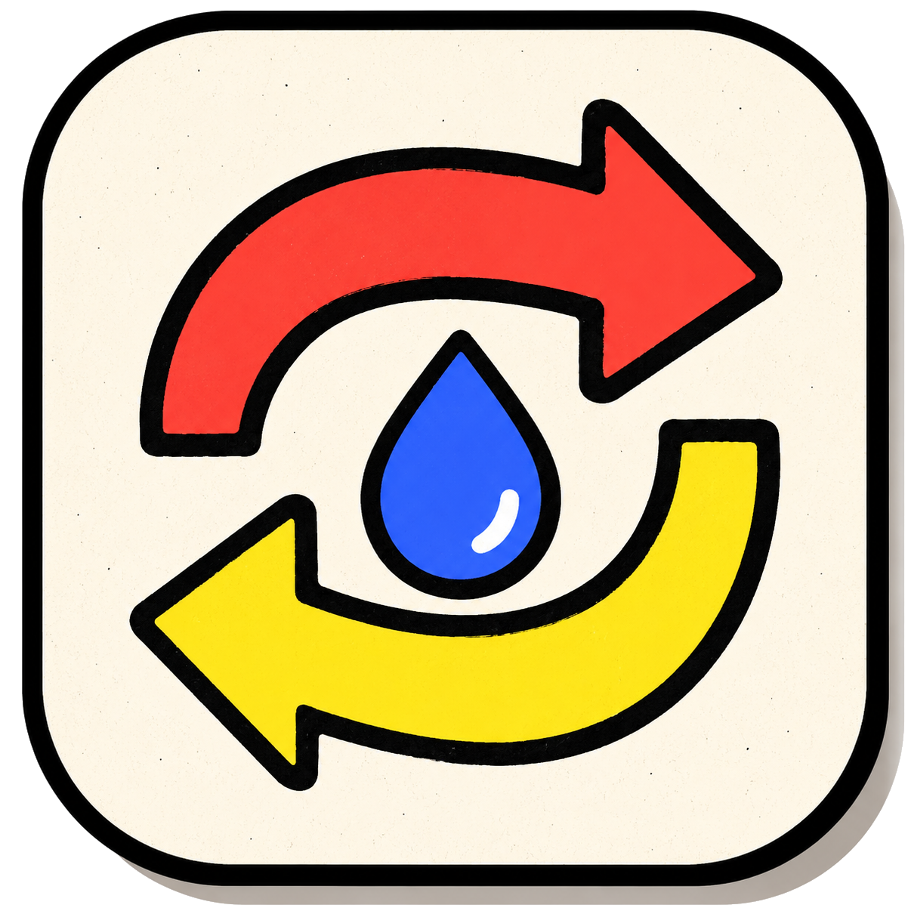

````md
<p align="center">
  
</p>

<h1 align="center">ez-drop</h1>

<p align="center">
  <strong>Serverless peer-to-peer file and text transfer for the browser.</strong>
</p>

<p align="center">
  <a href="https://vyas-devgna.github.io/ez-drop/">
    
  </a>
  
  
  
  
</p>

<p align="center">
  <a href="#highlights">Highlights</a>
  ·
  <a href="#live-architecture">Architecture</a>
  ·
  <a href="#transfer-protocol">Protocol</a>
  ·
  <a href="#browser-support">Browser Support</a>
  ·
  <a href="#local-development">Local Development</a>
  ·
  <a href="#deployment">Deployment</a>
  ·
  <a href="#privacy">Privacy</a>
</p>

---

ez-drop is an installable static web app for quick browser-to-browser sharing. It uses PeerJS for rendezvous/signaling, WebRTC DataChannels for encrypted peer transfer, and a service worker for the offline app shell. There is no app server, upload bucket, account system, or database behind it.

> [!TIP]
> Open the app on two devices, connect with a room code or QR code, approve the request, and send files or text directly between browsers.

---

## Highlights

- **Serverless static app**: deploys cleanly to GitHub Pages or any static host.
- **WebRTC P2P transfer**: files and text move over encrypted browser DataChannels.
- **Room code, link, and QR pairing**: fast pairing without accounts.
- **PWA install support**: offline app shell, app icons, and manifest wiring.
- **Web Share Target support**: supported installed Chromium PWAs can receive shared files/text from the OS share sheet.
- **File offers before transfer**: receivers see file details and accept before bytes are sent.
- **Mobile-first UI**: safe-area support, numeric room-code keyboard, large tap targets, and mobile download fallbacks.
- **LAN route detection**: WebRTC candidate inspection labels LAN/direct/relay routes and enables a faster LAN profile when possible.
- **Folder and multi-file sending**: supports multiple files and Chromium folder selection.
- **Checksums**: SHA-256 verification for eligible transfers.
- **History and known clients**: IndexedDB-backed local transfer history and remembered browser peers.

---

## Live Architecture

```mermaid
flowchart LR
    A[Browser A] -->|room code / PeerJS signaling| S[PeerJS signaling]
    B[Browser B] -->|room code / PeerJS signaling| S
    A <-->|encrypted WebRTC DataChannel| B
    A -.->|service worker app shell| C[(Cache Storage)]
    A -.->|history / shared payload queue| D[(IndexedDB)]
````

PeerJS helps browsers find each other. File contents are not uploaded to an ez-drop backend. Once the DataChannel is open, transfer messages move directly between the connected browsers whenever the network allows it.

---

## What It Can And Cannot Do

ez-drop is intentionally a **serverless browser app**, so it follows browser security boundaries.

<table>
  <tr>
    <th align="left">It can</th>
    <th align="left">It cannot</th>
  </tr>
  <tr>
    <td valign="top">

* Use WebRTC direct/LAN/relay-selected paths.

* Receive OS share-sheet payloads where Web Share Target is supported.

* Use File System Access APIs on supported Chromium desktop browsers.

* Cache the app shell for offline loading.

* Transfer files while the page/PWA is open and active.

  </td>
  <td valign="top">

* Open raw TCP sockets.

* Run a LAN HTTP server from the browser.

* Send or receive UDP multicast/broadcast packets.

* Guarantee always-on background receiving while the app is closed.

* Fully implement native LocalSend discovery/protocol without a native helper.

  </td>
  </tr>

</table>

---

## Transfer Protocol

ez-drop uses structured DataChannel messages:

| Message                      | Purpose                                                      |
| ---------------------------- | ------------------------------------------------------------ |
| `hello`, `accept`, `decline` | connection handshake.                                        |
| `route-info`                 | LAN/direct/relay route reporting.                            |
| `file-offer`                 | receiver-facing file request metadata.                       |
| `file-accept`                | approval to start bytes.                                     |
| `file-meta`                  | transfer metadata including chunk size and optional SHA-256. |
| `file-chunk`                 | binary ArrayBuffer chunks.                                   |
| `file-complete`              | finalization signal.                                         |
| `file-cancel`, `file-error`  | control and recovery messages.                               |
| `text`                       | text/link snippets.                                          |

Default chunking:

| Route            | Chunk size |
| ---------------- | ---------: |
| Standard route   |    `64 KB` |
| LAN fast profile |   `256 KB` |

---

## Browser Support

Core requirements:

| Requirement        |
| ------------------ |
| WebRTC DataChannel |
| Service Worker     |
| Cache Storage      |
| IndexedDB          |
| File API           |

Enhanced features are browser-dependent:

| Feature                             | Browser dependency                                  |
| ----------------------------------- | --------------------------------------------------- |
| Web Share Target                    | mostly installed Chromium PWAs.                     |
| File System Access save/folder APIs | Chromium-family browsers, strongest on desktop.     |
| Screen Wake Lock                    | supported browsers only, while visible/active.      |
| Camera QR scanning                  | requires camera permission and a compatible device. |

---

## Local Development

No build step is required.

```bash
python3 -m http.server 4173
```

Then open:

```text
http://127.0.0.1:4173/
```

Useful checks:

```bash
node --check app.js
node --check sw.js
```

---

## Deployment

Deploy the repository as static files. For GitHub Pages:

1. Push to GitHub.
2. Open repository **Settings**.
3. Go to **Pages**.
4. Select the branch/folder.
5. Save and open the Pages URL.

The app expects these static assets:

```text
index.html
app.js
styles.css
sw.js
assets/logo.png
```

---

## Privacy

* ez-drop does not require accounts.
* ez-drop does not provide a file upload server.
* Transfer history and queued share payloads are stored locally in the browser via IndexedDB.
* Files may exist temporarily in browser memory and object URLs until saved, cleared, or the page is closed.
* Signaling metadata necessarily touches the configured PeerJS signaling service so browsers can establish a connection.

---

## Contributing

Contributions are welcome. Please read [CONTRIBUTING.md](CONTRIBUTING.md), [CODE_OF_CONDUCT.md](CODE_OF_CONDUCT.md), and [SECURITY.md](SECURITY.md) before opening issues or pull requests.

---

## License

MIT. See [LICENSE](LICENSE).

```
```
